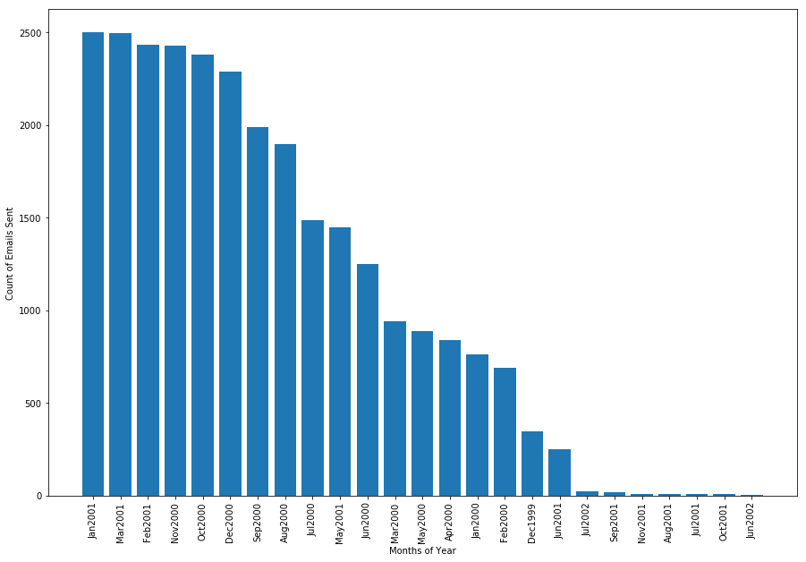
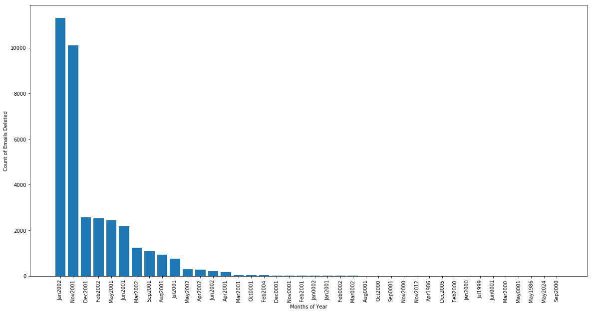

# Midterm
>The project is about analyzing 2 datasets
  - Enron's Emails
  - New York Times Articles
    - Archive
    - Article Search

## Analizing Enron Dataset

### About:
The Enron scandal, publicized in October 2001, eventually led to the bankruptcy of the Enron Corporation, an American energy company based in Houston, Texas, and the de facto dissolution of Arthur Andersen, which was one of the five largest audit and accountancy partnerships in the world.

## Analysis1:

### Purpose
Purpose of this analysis is to access the Enron's email and find useful information. It is to find the total count of emails sent from enron's employee for each month. This gives us a subset of emails to parse through and set the priorities to emails.

#### Step1:

##### Data Preparation:
  - os
  - glob
  - Email Parser
  - csv
  -File Location: 'C:\Users\DELL PC\midterm\data\enron\users\maildir'

##### Data Extraction:
  - extract the users list in mail directory.
  - use email parser to parse through dates emails were sent.

##### Data Cleaning
  - re
  - use of replace

##### Data Transformation
  - count the frequency of dates in list.
  - The output represents the total mails sent during particular month.
  - Setting the priority to each month as per their frequency

##### Output
  - CSV File at 'C:\Users\DELL PC\midterm\que[1-2]\ana_[1-3]\emailsSent.csv'
  - Plot featuring count of total emails sent every month.
  - Plot image at 'C:\Users\DELL PC\midterm\que[1-2]\ana_[1-3]\emailsSent.png'

##### Conclusion:
    - Based on the analysis done on sent items, it tells that the entities related to the company sent most of the emails on Jan2002, Mar2001, Feb2001, Nov2000 etc.
    - This clearly raises the flag that the company was going through alot of suspecious activities during these months as compared to other months.
    - It is important to go through the emails of respective first because this is the duration when the company was going through chaos.

## Analysis2:

### Purpose
The purpose of this analysis is to find the useful information company was trying to hide by deleting emails. During this analysis we will find the months during which fraudulent activities were going through. Later during this analysis we will be looking at the keywords which showed up frequently to gain more knowledge on the issue.

#### Step1:

##### Data Preparation:
  - os
  - glob
  - Email Parser
  - csv
  -File Location: 'C:\Users\DELL PC\midterm\data\enron\users\maildir'

##### Data Extraction:
  - extract the users list in mail directory.
  - use email parser to parse through dates emails were sent.

##### Data Cleaning
  - re
  - use of replace

##### Data Transformation
  - clean the dates and store in dates list.
  - count the frequency of dates in list.
  - The output represents the total mails deleted during particular month.
  - use email parser to parse through contents of the emails were deleted.
  - clean the data and store in data list, word by word and store them in text file.
  - count the frequency of words in list.
  - The output represents the frequency of words in those emails mails deleted during particular month.

##### Output
  - CSV File at 'C:\Users\DELL PC\midterm\que[1-2]\ana_[1-3]\deletedEmails.csv'
  - Plot featuring count of total emails deleted every month.
  - Plot image at 'C:\Users\DELL PC\midterm\que[1-2]\ana_[1-3]\emailsDel.png'
  - Top words from the emails deleted.

##### Conclusion:
  - Based on the analysis done on deleted items, it tells that the entities related to the company deleted most of the emails    on Jan2002 and Nov2001.
  - This clearly raises the flag that the company was trying to hide some important information during these months.
  - It is important to go through the deleted emails of Jan2002 and Nov2001 first because this is the duration when the            company proved to be fraud.
  - The second analysis provides the top 500 words from the deleted emails. Words like:
    - TD: 107176(oronto-Dominion Bank paid $130-million (U.S.) to settle claims relating to the demise of Enron Corp
    - gas: 27689
    - yahoo: 5698
    - debt: 5698
    - aol: 5887 etc.
  - Analyzing these words can help in finding information company didnt want anybody to know.
  
## Analysis2:

### Purpose
The purpose of this analysis is to find the useful information company was trying to hide by deleting emails. During this analysis we will find the months during which fraudulent activities were going through. Later during this analysis we will be looking at the keywords which showed up frequently to gain more knowledge on the issue.

#### Step1:

##### Data Preparation:
  - os
  - glob
  - Email Parser
  - csv
  -File Location: 'C:\Users\DELL PC\midterm\data\enron\users\maildir'

##### Data Extraction:
  - extract the users list in mail directory.
  - use email parser to parse through dates emails were sent.

##### Data Cleaning
  - re
  - use of replace
  - Stopwords
  - Word_Tokenize
                                 
##### Data Transformation
  - clean the dates and store in dates list.
  - count the frequency of dates in list.
  - The output represents the total mails deleted during particular month.
  - use email parser to parse through contents of the emails were deleted.
  - clean the data and store in data list, word by word and store them in text file.
  - count the frequency of words in list.
  - The output represents the frequency of words in those emails mails deleted during particular month.

##### Output
  - CSV File at 'C:\Users\DELL PC\midterm\que[1-2]\ana_[1-3]\deletedEmails.csv'
  - Plot featuring count of total emails deleted every month.
  - Plot image at 'C:\Users\DELL PC\midterm\que[1-2]\ana_[1-3]\emailsDel.png'
  - Top words from the emails deleted.

##### Conclusion:
  - Based on the analysis done on deleted items, it tells that the entities related to the company deleted most of the emails on Jan2002 and Nov2001.
  - This clearly raises the flag that the company was trying to hide some important information during these months.
  - It is important to go through the deleted emails of Jan2002 and Nov2001 first because this is the duration when the company proved to be fraud.
  - The second analysis provides the top 500 words from the deleted emails. Words like:
    - TD: 107176(oronto-Dominion Bank paid $130-million (U.S.) to settle claims relating to the demise of Enron Corp
    - gas: 27689
    - yahoo: 5698
    - debt: 5698
    - aol: 5887 etc.
  - Analyzing these words can help in finding information company didnt want anybody to know.                                 
                                 
## Analysis3:

### Purpose
The purpose of this analysis is to go through all the folder os CEO Lay-K and find useful information. During this analysis we will find the employees who sent mail to the CEO and the recipient's of CEO's mails. This way we can connect the dots and find possible people involved in this fraud.

#### Step1:

##### Data Preparation:
  - os
  - glob
  - Email Parser
  - csv
  -File Location: 'C:\Users\DELL PC\midterm\data\enron\users\maildir'
  
                                 
##### Data Extraction:
  - Set the userPath to Lay-k's directory.
  - Go through each folder for his directory and using email parser, extract the senders..

##### Data Cleaning
  - re
  - use of replace
  - Stopwords
  - Word_Tokenize
                                 
##### Data Transformation
  - Loop in all the folders in mail directory of Lay-k.
  - use email parser to parse through contents of the emails were sent or deleted or inboxed(all possible data).
  - clean the data and store in data list, word by word and store them in text file.
  - count the frequency of words in list.

##### Output
  - Top 20 email sender's
  - Top 20 Emails receivers
  - Txt File at 'C:\Users\DELL PC\midterm\que[1-2]\ana_[1-3]\emailsMessage.txt'
  - Top words from the emails fetched from Lay-k folders.

##### Conclusion:
  - It is important to analyze Enron's CEO's profile as a part of this project.
  - The top sender's list provides the list of people who were in direct frequent contact during the scam.
  - The top receiver's list provides the list of people with whom the CEO was in direct frequent contact during the scam.
  - The pupose of last activity was to find the top used words used by the CEO during this period.
  - Words like energy and company tells that enron was an energy company.
  - Frequent use of california tells about the shortage of electricity supply caused by market manipulations, illegal[5] shutdowns of pipelines by the Texas(Houston word used frequently) energy consortium Enron.
  - declared and bankruptcy has been used frequently as well.                               
                                 
## Analizing New York Times Dataset

### Purpose:
The purpose is to collect data from New York Times inventory using 2 APIs:
    - Archive API
    - Article Search API
After collecting data store it in json format files.

### Steps to extract using Archive API

- Generate API Key.
- Set the parameters(year, month)
- Put the paramets value in url
- request the urls and store the response in content.
- open the json format file with month and year name in it and dump the content in the file.

#### Imports
  - requests
  - datetime
  - time
  - json
  - os

Data stored at : 'C:\Users\DELL PC\midterm\que[1-2]\ana_[1-3]\Articles\jsonData'

### Steps to extract using Article Search API

- Generate API Key.
- Set the parameters(year, month, begin_date, end_date, q).
- Loop in the pages from 0-120.
- Put the paramets value in url.
- Give a time delay of 5 seconds.
- request the urls and store the response in content.
- open the json format file with month and year name in it and dump the content in the file.

#### Imports
  - requests
  - datetime
  - time
  - json
  - os

Data stored at : 'C:\Users\DELL PC\midterm\que[1-2]\ana_[1-3]\Articles\jsonData\ArticleSearch'

## Analysis1:

### Purpose
The purpose of this analysis is to find the word frequency in headlines and find the trending topic during the period. API Used: Archive

#### Step1:

##### Data Preparation:
  - os
  - glob
  - re
  - os

##### Data Extraction:
  - extract the data deom the json file stored at 'C:\Users\DELL PC\midterm\que[1-2]\ana_[1-3]\Articles\jsonData\'.
  - use glob to read the file.

##### Data Cleaning
  - re
  - use of replace
  - use of regex

##### Output
  - Frequency of words in headlines from that month.
  - List of headlines

##### Conclusion:
    - Trending news for 01/2017:
    - Donald Trump
    - Obama
    - Army Briefing
    - Inaugration
    - Immigration

## Analysis2:

### Purpose
The purpose of this analysis is to find the word frequency in keywords and find the trending topic during the period. API Used: Archive

#### Step1:

##### Data Preparation:
  - os
  - glob
  - re
  - os

##### Data Extraction:
  - extract the data deom the json file stored at 'C:\Users\DELL PC\midterm\que[1-2]\ana_[1-3]\Articles\jsonData\'.
  - use glob to read the file.

##### Data Cleaning
  - re
  - use of replace
  - use of regex

##### Output
  - Frequency of words in headlines from that month.
  - List of headlines

##### Conclusion:
Trending Keywords:
    - Obama 
    - Trump
    - Administration
    - Women
    - American

## Analysis3:

### Purpose
The purpose of this analysis is to find the parts of speech in the json files and their frequency.
API Used: Article Search

#### Step1:

##### Data Preparation:
  - nltk
  - os
  - glob
  - re
  - os

##### Data Extraction:
  - extract the data deom the json file stored at 'C:\Users\DELL PC\midterm\que[1-2]\ana_[1-3]\Articles\jsonData\ArticleSearch\'.
  - use glob to read the file.

##### Data Cleaning
  - re
  - use of replace
  - use of regex

##### Output
  - Keywords
  - POS Tag of each word
  - Frequency of POS

#Thank you!

                                 
                                 
                                 
                                 
                                 
                                 
                                 
                                 
                                 
                                 
                               
